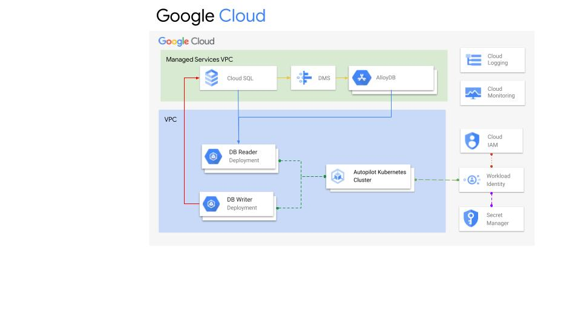

# Postgres Migrate Sample
[](LICENSE.md)

## Overview
<a id="Overview"></a>

This is a sample workload which demonstrates how you can synchronize DB records from [CloudSQL](https://cloud.google.com/sql) to [AlloyDB](https://cloud.google.com/alloydb) using [Cloud DMS](https://cloud.google.com/database-migration).
- [CloudSQL](https://cloud.google.com/sql) - Cloud SQL manages your databases so you don't have to, so your business can run without disruption. It automates all your backups, replication, patches, encryption, and storage capacity increases
- [AlloyDB](https://cloud.google.com/alloydb) - A fully managed PostgreSQL—compatible database service for your most demanding enterprise workloads. AlloyDB combines the best of Google with PostgreSQL, for superior performance, scale, and availability.
- [Cloud DMS](https://cloud.google.com/database-migration) (Database Migration Service) - A managed service to handle the migration of data between database solution

To help simulate migration during use there are two small sample applications running inside containers managed by [GKE Autopilot](https://cloud.google.com/kubernetes-engine/docs/concepts/autopilot-overview). GKE Autopilot is a mode of operation in GKE in which Google manages your cluster configuration, including your nodes, scaling, security, and other preconfigured settings. The writer part of the application preforms random updates to the [sample database provided by PostgreSQL (DVD Rentals)](https://www.postgresqltutorial.com/postgresql-getting-started/postgresql-sample-database/) hosted on CloudSQL. A second application, reader, checks both the source Cloud SQL and the target AlloyDB instances to show a per table record count. 
Cloud DMS is used to continuous replicate the data from CloudSQL to AlloyDB. This is currently configured for one way replication, but it can be configured for two way synchronization.

There are several additional components used to simplify application:
- [Cloud Secret Manager](https://cloud.google.com/security/products/secret-manager) - Used to store the Database Credentials. [We can map secrets from the managed secret service into the POD as kubernetes secrets](https://cloud.google.com/kubernetes-engine/docs/tutorials/workload-identity-secrets)
 - [Workload Identity](https://cloud.google.com/kubernetes-engine/docs/how-to/workload-identity) - Used to embed service accounts into the environment, [enabling workloads to access Google Cloud products and features with dynamic service account credentials](https://cloud.google.com/kubernetes-engine/docs/how-to/workload-identity#authenticating_to).
- [AlloyDB Auth Proxy](https://cloud.google.com/alloydb/docs/auth-proxy/overview) - Used to simplify connections from the Reader Pod to the AlloyDB instance. There is also a [CloudSQL Auth Proxy too](https://cloud.google.com/sql/docs/postgres/sql-proxy), however this use case focused on utilization of GKE Autopilot and AlloyDB. Both of the proxy agents can be run in docker, or CLI.

**Additional things of point are:**
- [Cloud SQL Plugin Enablement](https://cloud.google.com/sql/docs/postgres/extensions) - This requires a reboot when configure
- [AlloyDB Plugin Enablement](https://cloud.google.com/alloydb/docs/reference/extensions) - This requires a reboot when configured


## Table of Contents
- [Overview](#overview)
- [Network Diagram](#network-diagram)
- [Installation](#installation)
  - [Manual Steps](#manual-install)
  - [Validation](#validate-changes)
- [Prerequisites](#prerequisites)
- [Tool Setup Guide](#tool-setup-guide)


## Network Diagram
<a id="network-diagram"></a>


## Installation
<a id="installation"></a>
Terraform will be used to deploy the entire application, however there are still some manual steps (install the sample DB for example)

### Manual Configuration:
<a id="manual-install"></a>
1. Create a new Project
1. [Create a default VPC](https://cloud.google.com/vpc/docs/create-modify-vpc-networks) (with at least one region configured, recommended us-west1 or us-central1)
1. [Next we provision a CloudSQL instance with private IP address](https://cloud.google.com/sql/docs/postgres/connect-instance-private-ip)
    1. [This also includes information the Cloud SQL Proxy](https://cloud.google.com/sql/docs/postgres/connect-kubernetes-engine#proxy)
    1. Copy the Postgres username, password, and private IP address for later
    1. You will need to connect to the CloudSQL DB instance using the [Cloud SQL Proxy agent]((https://www.postgresqltutorial.com/postgresql-getting-started/postgresql-sample-database/)), and install the [PostgreSQL sample database](https://www.postgresqltutorial.com/postgresql-getting-started/postgresql-sample-database/)
1. [Next we provision a AlloyDB Instance also with a private IP address (default)](https://cloud.google.com/alloydb/docs/cluster-create)
    1. [This also includes information the AlloyDB Auth Proxy](https://cloud.google.com/alloydb/docs/auth-proxy/overview)
    1. Copy the Postgres username, password, and private IP address for later
1. [Next we configure secret manager with the username and passwords for each instance](https://cloud.google.com/secret-manager/docs/creating-and-accessing-secrets)
    1. Name: **srcdb** -- Must be the name of the secret
    1. Value: **db_user:{user},db_password:{password},db_name:{database_name},db_host:{private_ip}**
    1. Name: **targetdb** -- Must be the name of the secret
    1. Value: **db_user:{user},db_password:{password},db_name:{database_name},db_host:{private_ip}**
1. Now we need to configure DMS. [We need to setup a workflow which will setup replication between the source](https://cloud.google.com/database-migration/docs/postgres/quickstart)
    1. When configuring the source we will use the values from the CloudSQL instance using the private instance IP
    1. When configuring the target we will use the values from the AlloyDB instance using the private instance IP
  This will need a bit of time to test and setup replication. We can monitor replication status from the job page within [Cloud DMS Console](https://console.cloud.google.com/dms)
1. [Provision a GKE Autopilot cluster](https://cloud.google.com/kubernetes-engine/docs/how-to/creating-an-autopilot-cluster) (this will by default enable workload identity)
1. [Create and configure a new Service Account for use with Workload Identity](https://cloud.google.com/iam/docs/service-accounts-create)
    1. Grant the following permissions:
        1. ***roles/iam.workloadIdentityUser*** - Enable SA to be used with Workload Identity
        1. ***roles/secretmanager.secretAccessor*** - Enable access to secrets
        1. ***roles/logging.logWriter*** - Used to write application logs
1. [Connect to the GKE Autopilot cluster with Kubectl](https://cloud.google.com/kubernetes-engine/docs/how-to/creating-an-autopilot-cluster#connecting_to_the_cluster)
1. Deploy the Reader & [Writer Yaml](./database%20app/writer/deployment.yaml) [Deployment Yaml](./database%20app/reader/deployment.yaml) 


### Validate Changes Replicating
<a id="validate-changes"></a>

When the rollout of the yaml is complete you should need to find the ingress IP for the Reader deployment on GKE Autopilot. You can find this on the [Gateway, Services & Ingress](https://console.cloud.google.com/kubernetes/discovery) page within the GKE section. Refresh the page and you should see the staff record count change.

You can also connect to either databases via the proxy remotely ((Cloud SQL)[(https://www.postgresqltutorial.com/postgresql-getting-started/postgresql-sample-database/)], [Alloy DB](https://cloud.google.com/alloydb/docs/auth-proxy/connect)) and after connecting to the dvd rental. You can use the following query to look for the changes:
``` sql
SELECT * FROM STAFF ORDER BY last_update Desc limit 5;
```


## Prerequisites
<a id="prerequisites"></a>
GCP Project With Billing Enabled
- Your user account will need permissions to:
- Enable API for GCP Services
- Provision CloudSQL instances
- Provision AlloyDB Instances
- Provision GKE Clusters
- Provision Cloud DMS workflows
- Provision and manage Cloud Secrets
- Provision VPC Networks (or use existing shared VPC)
- Configure VPC networks
- Create Service Accounts
- Recommendation is that you get Project Owner role


## Tool Setup Guide
<a id="tool-setup-guide"></a>
[Tool Install Guide](tools/ReadMe.md)